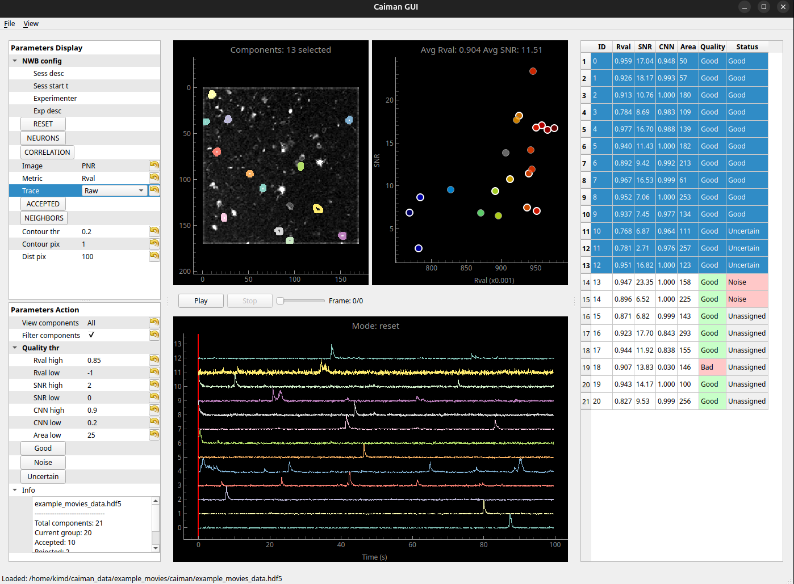
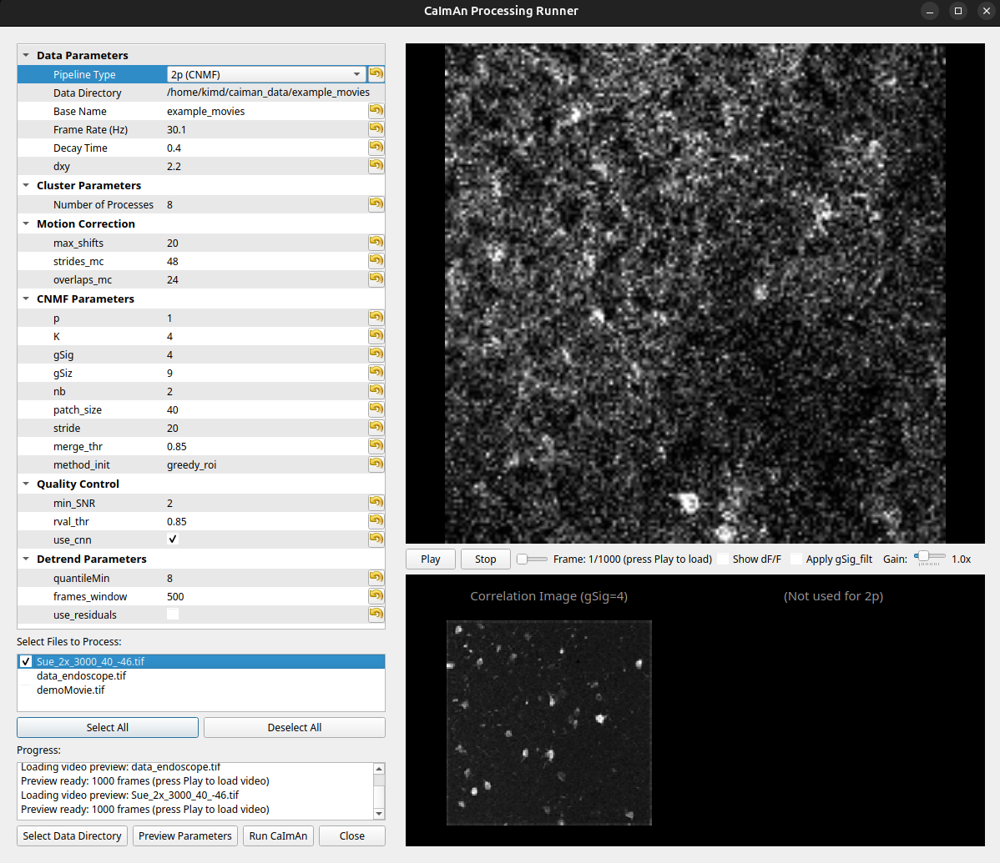

# CaimanGUI
A graphical user interface for visualizing CaImAn processed imaging data.

[CaImAn](https://github.com/flatironinstitute/CaImAn) is a powerful computational software to process one-photon and two-photon imaging data. Here, CaimanGUI provides complementary visulizing functionalities that help neuroscientists to curate their processed imaging data.

## Installation
```
conda create -n caiman caiman
conda activate caiman
pip install git+https://github.com/nctrl-lab/CaimanGUI
```
CaimanGUI is built upon [pyqtgraph](https://pyqtgraph.readthedocs.io/en/latest/) that is included in the CaImAn package. Thus, you can simply run CaimanGUI in `caiman` environment (assume you call `caiman` for your CaImAn installation):
```
conda activate caiman
caiman
```

## Getting started

### Using the GUI
<p align="center" width=100%>
  
</p>

CaimanGUI is mainly designed for visualizing CaImAn processed one-photon imaging data (should also work for two-photon data). The implemented functionalities are partly inspired by the widely used [Suite2p](https://github.com/MouseLand/suite2p) software for two-photon data.

### Neuron Table
The neuron table provides a Phy-like interface for viewing and managing neurons. It displays:
- **ID**: Neuron identifier
- **Rval**: Spatial correlation score
- **SNR**: Signal-to-noise ratio
- **CNN**: CNN prediction score (if available)
- **Area**: Number of pixels in spatial footprint
- **Quality**: Component quality based on CaImAn filtering (Good/Bad)
- **Status**: User-assigned status (Good/Noise/Uncertain/Unassigned)

The table supports:
- **Sorting**: Click column headers to sort (numeric sorting for ID, Rval, SNR, CNN, Area)
- **Filtering**: Use "View components" dropdown to filter by status (All, Accepted, Rejected, Uncertain, Unassigned)
- **Selection**: Click rows to select neurons (Ctrl/Shift for multiple selection)

### Quality Filtering
The GUI includes quality thresholds for filtering components:
- **Rval high/low**: Spatial correlation thresholds
- **SNR high/low**: Signal-to-noise ratio thresholds
- **CNN high/low**: CNN prediction thresholds
- **Area low**: Minimum area threshold (in pixels)

Components must meet both low thresholds (AND) and at least one high threshold (OR) to pass quality filtering.

### Keyboard Shortcuts
- **Ctrl+R**: Run CaImAn processing

- **Ctrl+O**: Open HDF5 file
- **Ctrl+S**: Save data
- **Ctrl+Shift+S**: Save as...
- **Ctrl+W**: Exit application

- **ESC**: Unselect all neurons
- **Alt+G**: Mark selected neuron(s) as Good (Accepted)
- **Alt+N**: Mark selected neuron(s) as Noise (Rejected)
- **Alt+M**: Mark selected neuron(s) as Maybe (Uncertain)
- **Up/Down arrows**: Navigate through neurons

### View Modes
The GUI supports several viewing modes:
- **reset**: Initialization mode showing contours of the current group
- **neurons**: Show colormap of the current group, display multiple selected components
- **correlation**: Show single selected component and all other components colored by temporal correlation
- **accepted**: Display accepted components with keyboard navigation
- **neighbors**: Display neighbor correlation of accepted components

### CaImAn Runner (Ctrl+R)
<p align="center" width=100%>
  
</p>

Run the full CaImAn processing pipeline from the GUI:
1. Select data folder (AVI/TIFF)
2. Choose pipeline type — 1p (CNMF-E) or 2p (CNMF)
3. Adjust parameters
4. Preview → Run

### Motion-corrected movie
<p align="center" width=100%>
  
</p>

You can also visualize the motion-corrected movie (menu View/Movie) together with the corrected in-plane shifts and the fluorescence trace of a selected cell. Note that reading a F-order memory-mapped file is faster than a C-order memory-mapped file.

### Outputs

CaimanGUI outputs include:
- **accepted_list**: List of accepted cell IDs (caiman_model.estimates.accepted_list)
- **rejected_list**: List of rejected cell IDs
- **uncertain_list**: List of uncertain cell IDs (needs further review)
- **idx_components**: Components passing quality filters (this is updated by the **Quality Filtering** criteria)
- **idx_components_bad**: Components failing quality filters

All data is saved in the HDF5 or NWB format, preserving the full CaImAn CNMF object structure.
